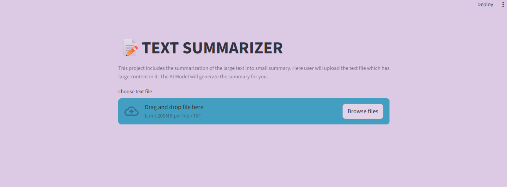

# 📌Text Summarrizer using langchain 
This project is **AI powered Text summarization** built using **OpenAI LLM - 'gpt-3.5-turbo'**.It helps user generate the **quality summary for the text inputed** based on given text making content creation faster and more effective .


## 🧠Overview
This project helps to create summary for the text. 
Made the use of OpenAI (gpt-3.5-turbo) model.
There are text file created 'sample.txt'.
Requirements.txt contains all the library that is required to be installed.

## 🚀Key Features 
- Generate text summary from simple prompt
- Support different tones (professional , simple , technical , student friendly)
- clean and reusable prompt

## 🛠️Tech Stack 
- Programming Language : Python
- LLM Provider : OpenAI('gpt-3.5-turbo')
- AI Model : OpenAI
- Data Format : Text


<h1>🛒Requirement</h1>
<b>Python version</b>
<br>
-Python(3.11.5)<br>
<br>
<b>IDE/Code Editor</b>
<br>
-VS Code
</br>

<b> 📦Installation </b>
Create and Activate a virtual Environment 
CREATE  
``` bash
python -m  venv venv
```
ACTIVATE 
``` bash
venv\Scripts\activate
```
### ▶️ Running the Application
``` bash
streamlit run text_summarizer.py
```

<b><p>⭐ If you found this repository useful, consider giving it a star!</p>
<p>Happy Coding 🐍✨</p></b>
<br>
👤 Github  : [@droliasakshi12](https://github.com/droliasakshi12)<br>
📩 Email   : droliasakshi601@gmail.com <br>
🔗 Linkdin : https://www.linkedin.com/in/sakshi-drolia12<br>

<b><h5>Author</h5></b>
<h6><b>Sakshi Drolia</b></h6>
